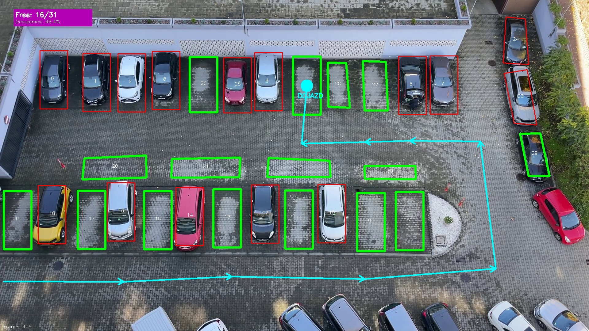

# 🅿️ Parking Spot AI - Parking Space Detection System

A flexible parking space detection system using computer vision to monitor parking lot occupancy in real-time. The system supports multiple parking configurations and processes both video streams (including IP cameras/YouTube) and static images.

## 🚀 Key Features

* **Automatic Setup Workflow:** The `main.py` script provides a guided wizard to calibrate, configure, and annotate a new parking lot from start to finish.
* **Dimension Calibration:** Interactive mode (`-m c`) to measure parking space dimensions (`rect_width`, `rect_height`).
* **Advanced Annotation:** Supports **Rectangular** (`P`), **Irregular** (`I`), **Route Points** (`T`), and **Edit ID** (`E`) modes.
* **A\* Pathfinding Algorithm:** Calculates the optimal, safe route to the nearest free parking space, avoiding occupied spots.
* **Video Support:** Monitors from files, IP cameras, and YouTube videos (requires `yt-dlp` and FFMPEG support).

## 🏁 Example Results

Here is an example of the system in action, identifying empty (green) and occupied (red) spaces, and calculating the A\* route (blue line) to the nearest free spot.

<p align="center">


## 🎯 Problem Definition & Solution

### Problem

Setting up a new parking lot surveillance system is often complex. Each camera has a different angle, and parking spaces have different dimensions, requiring manual code adjustments. Standard systems don't offer guidance for new lot configuration.

### Solution

This project provides a **generic, wizard-based solution**.

1.  **Automated Setup (`main.py`):** A master script runs you through all necessary steps, from calibration to monitoring.
2.  **Visual Calibration (`car_park_coordinate_generator.py`):** Instead of guessing pixel dimensions, you visually click two corners of a parking space to calibrate its size.
3.  **Generic Configuration (`config/parking_config.json`):** All settings (dimensions, thresholds, video paths) are stored in a central JSON file, allowing you to manage multiple lots without changing any code.
4.  **Advanced Annotation:** You can map out any parking lot shape (Rectangular/Irregular) and define navigation paths (`Route Points`) for the A\* algorithm.

## 💡 Core Concepts Used

* **Automated Workflow (`main.py`):** Uses the `subprocess` module to chain multiple Python scripts together, passing configuration data between them via temporary files.
* **Generic Configuration (`config_manager.py`):** A manager class that reads and writes to `parking_config.json`, decoupling the logic from specific lot settings.
* **Advanced Image Processing (`parking_classifier.py`):** Uses OpenCV techniques like Gaussian Blur, Adaptive Thresholding, and Dilation to isolate parking space markings and detect cars.
* **A\* Pathfinding (`parking_classifier.py`):** Implements the A\* search algorithm to find the shortest, safest path to an empty spot, using the user-defined `Route Points` as a graph.
* **Advanced Annotation UI (`coordinate_denoter.py`):** A stateful OpenCV GUI that handles multiple modes (P, I, T, E, C) and keyboard/mouse inputs for complex annotation.

## 📁 Project Structure

```
AI_parking_detector/
├── config/
│   └── parking_config.json          # Parking lot configurations and processing parameters.
├── data/
│   ├── parking_lots/                # Position files for different parking lots.
│   └── source/ 
|       ├── img/
|       └── video/
├── results/                         # Output folder for saved snapshots.
├── src/
│   ├── config_manager.py            # Configuration management.
│   ├── coordinate_denoter.py        # Annotation and calibration logic.
│   └── parking_classifier.py        # Classification and A* Pathfinding logic.
├── add_parking_config.py            # Interactively adds a new parking configuration.
├── app.py                           # Main monitoring application.
├── car_park_coordinate_generator.py # GUI tool for marking positions.
├── main.py                          # **Automatic setup workflow.**
└── requirements.txt
```

## 🔧 Installation

### Prerequisites

- Python 3.7+
- OpenCV
- NumPy
- Optional (for YouTube streams): yt-dlp and FFMPEG

### Install Dependencies

```bash
python -m venv venv
venv\Scripts\activate
pip install -r requirements.txt
```

## ⚙️ Automatic Setup (Recommended Workflow)

Use the `main.py` script to run the complete setup sequence for a new parking lot without needing to call each tool manually:

```bash
python main.py
```

This script acts as a 'wizard' or manager that automates the entire setup. It works by calling the other command-line tools (`car_park_coordinate_generator.py`, `add_parking_config.py`, and `app.py`) in the correct sequence, using temporary files to pass crucial data (like calibration dimensions) between steps.

### Automatic Configuration Sequence

1. **Reference File Selection:** Interactively choose a reference image.
2. **Calibration (Mode 'c'):** The calibration tool starts automatically. In the window:
   - Press 'c'
   - Click two corners of a typical parking space
   - The dimensions will be saved and used in the next step
   - Close the window
3. **Configuration Creation:** `add_parking_config.py` runs. The W/H dimensions from calibration are automatically loaded and suggested.
4. **Annotation (Marking Positions):** `car_park_coordinate_generator.py` restarts for the new parking lot. Mark all spaces and route points.
5. **Start Monitoring:** `app.py` launches automatically with the new configuration.

## 🎯 Manual Annotation (car_park_coordinate_generator.py)

A GUI tool for precise position marking:

```bash
python car_park_coordinate_generator.py --lot <your_lot_name>
```

### Editor GUI — Detailed Controls & Tips ✅

The annotation editor (`car_park_coordinate_generator.py`) provides an interactive GUI with helpful on-screen hints and a compact overlay console.

| Mode / Action | Key / Mouse | Description |
|--------------|-------------|-------------|
| Rectangular  | `P` / L-Click | Add a rectangular space. **Mouse wheel** rotates the preview rectangle. Preview is shown under the cursor. Right-click deletes a space. |
| Irregular    | `I` / L-Click | Click 4 corners to create a polygon-shaped space. Right-click cancels the last point. |
| Route Points | `T` / L-Click | Add a route point (for A* pathfinding). `R-Click` removes the last point. |
| Edit ID      | `E` / L-Click | Click on a spot to open an ID editor. Type the new ID and press `Enter` to confirm. `Backspace` edits, `Esc` cancels. |
| Calibration  | `C` / L-Click | Click **two corners** of a typical parking space, then press `Enter` to save. Values are stored in `config/temp_calibration.json`. |
| Save         | `S` | Save positions to the lot file (`data/parking_lots/<lot>_positions`). |
| Reset        | `R` | Reset (delete) all points in the current lot. |
| Toggle UI    | `U` | Hide/Show UI overlays and buttons. |
| Toggle Logs  | `H` | Toggle the on-screen Overlay Console (scrollable logs, `CLEAR` button). |
| Help Panel   | Click top-left **POMOC** button | Opens a help panel with shortcuts and tips. |
| Quit         | `Q` / `ESC` or click the on-screen button | Exit editor (saves unless in calibration mode).

Notes:
- The editor shows helpful status bars (mode, hints) and a small overlay console for logs. Use the mouse to interact with the console (scroll wheel to page, `CLEAR` button to wipe logs).
- When in calibration mode (`--mode c`) the editor only accepts calibration points; press `Enter` to finish.

---

## 🎥 Parking Monitoring (app.py)

Runs the real-time analysis or analyzes a static image:

```bash
python app.py --lot <your_lot_name> --video <your_video_source>
```

### Command Line Options

| Option | Description | Example |
|--------|-------------|---------|
| --lot, -l | Name of the parking lot configuration (default: 'default') | --lot mall |
| --video, -v | Video source (file, IP camera, YouTube URL, camera index: 0) | --video 0 or --video https://youtube.com/... |
| --image, -i | Path to a static image | --image data/img.jpg |
| --mode, -m | Mode: video (default) or image | --mode image |
| --output, -o | Path to save the output video file | --output out.mp4 |
| --scale_percent | Scale the output video/image display (e.g., 50 for 50%) | --scale_percent 50 |

### Interactive Tuning & GUI Controls 🔧

The monitoring window contains an interactive overlay console and an optional **TUNING** window (trackbars) for live parameter adjustment.

- **H** — Toggle on-screen log/console (Overlay Console). The console supports mouse wheel scrolling and a `CLEAR` button.
- **Ctrl+T** — Toggle the TUNING window (trackbars). When enabled, a preview of processed frame appears.
- **Trackbars (TUNING)** — `Threshold (Pix)`, `Block Size`, `Constant C`, `Blur Kernel` (live changes).
- **W** (while TUNING is active) — Save current tuning values to `config/parking_config.json` (`threshold` for the parking lot and `processing_params` globally).
- **R** (while TUNING is active) — Reset trackbars to defaults from config.
- **P** — Pause / Resume video
- **Q** — Quit
- **On-screen button** — Click the `WYJSCIE` button (top-right) to exit

Notes:
- CLI flags (`--blur_kernel`, `--threshold_block`, `--threshold_c`, etc.) still allow starting with preconfigured overrides.
- YouTube streams are supported with `yt-dlp` (ffmpeg recommended).

### A* Pathfinding

In video mode, the system automatically draws the shortest and safest route to the first available parking space using the annotated route points.

### Monitoring Controls (Video)

- **Q:** Quit
- **P:** Pause/Resume
- **Ctrl+T:** Toggle Tuning window
- **W:** Save tuning settings (when tuning active)
- **R:** Reset tuning sliders (when tuning active)
- **H:** Toggle overlay logs
- **Click UI:** `WYJSCIE` button to quit


## 📝 A Note on Configuration & Data

* `config/parking_config.json`: This file stores the *settings* for each parking lot, such as its name, W/H dimensions, detection threshold, and video source path.
* `data/parking_lots/`: This directory stores the *coordinate data*. When you save positions in the `car_park_coordinate_generator.py` tool, it creates a file (e.g., `mall_parking_positions`) containing the list of all coordinates (for spots and route points) for that specific lot.

---

## 🙏 Acknowledgements

This project was significantly expanded and refactored with features like multi-lot management, A\* pathfinding, and an automated setup wizard.

The initial foundation, including the core OpenCV image processing pipeline (blur, thresholding) and the original OOP structure for classification, was inspired by the `car-parking-finder` project by **Noor Khokhar**. Thank you for sharing your work!

You can find the original repository here:
<https://github.com/noorkhokhar99/car-parking-finder.git>


## ***Happy parking monitoring! 🚗🅿️***
